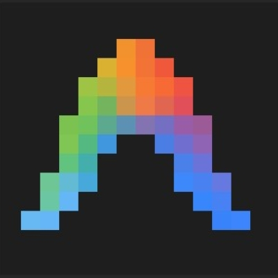

# 🛡️ audit-skill

> **Zero-Trust Security Auditor for AI Skills, GitHub Repositories, and Dependent Scripts**

[](https://github.com/CommanderDusK/audit-skill/releases)
[](https://opensource.org/licenses/MIT)
[](#-supported-agent-harnesses)
[](https://github.com/sickn33/agentic-awesome-skills)

`audit-skill` is an automated 5-step security auditing framework designed for AI agent environments. It inspects untrusted external GitHub skills, prompt definitions, embedded scripts (`.py`, `.js`, `.ts`, `.sh`), dynamic execution routines, and third-party dependencies before local registration or execution.

---

## 📑 Table of Contents

- [🛡️ Key Features](#️-key-features)
- [🧩 Required Dependencies](#-required-dependencies)
- [🌐 Supported Agent Harnesses](#-supported-agent-harnesses)
- [🚀 Installation Guide](#-installation-guide)
  - [Workspace Local Installation](#1-workspace-local-installation-per-project)
  - [Global Installation across Harnesses](#2-global-installation-across-harnesses)
  - [Harness-Specific Setup](#3-harness-specific-setup)
- [🔄 Versioning Strategy](#-versioning-strategy)
- [📂 Repository Structure](#-repository-structure)
- [📄 License](#-license)

---

## 🛡️ Key Features

- 👁️ **Ghost Prompt Detection:** Identifies hidden system overrides, zero-width Unicode characters, and indirect prompt injection vectors in `SKILL.md` files.
- 💻 **Static AST Code Analysis:** Detects unsafe code evaluation (`eval`, `exec`, `vm.runInNewContext`) and unauthorized shell subprocess calls across Python, JavaScript, TypeScript, and Shell scripts.
- 🌐 **Exfiltration Prevention:** Scans for unauthorized outbound telemetry, WebSockets, and hidden network fetch commands.
- 🛡️ **Workspace SAST & Path Auditing:** Verifies that file system operations stay bounded within designated sandbox target directories.
- 🔬 **STRIDE Threat Modeling:** Performs deep security audits on third-party package dependency chains before code execution.
- 📊 **Automated Report Generation:** Populates an expertly formatted markdown audit report directly into your workspace.

---

## 🧩 Required Dependencies

Before running `audit-skill`, ensure the following prerequisite tools and skills are installed in your environment:

| Dependency | Type | Source / Install Command | Role |
| :--- | :--- | :--- | :--- |
| **`smartbrain-skill-auditor`** | External Tool | `git clone [https://github.com/smartbrainactivity/smartbrain-skill-auditor.git](https://github.com/smartbrainactivity/smartbrain-skill-auditor.git) ~/tools/smartbrain-skill-auditor` | Static pre-install prompt & signature analysis |
| **`security-auditor`** | Agent Skill | `npx skills add sickn33/agentic-awesome-skills --skill security-auditor` | Directory path & permission constraint SAST |
| **`security-audit`** | Agent Skill | `npx skills add sickn33/agentic-awesome-skills --skill security-audit` | STRIDE threat modeling & dependency analysis |
| **`skill-audit`** | NPM CLI Tool | `npx skill-audit` | AST code vulnerability scanner |

---

## 🌐 Supported Agent Harnesses

`audit-skill` is built on the Open Agent Skill standard and runs natively across all major developer AI harnesses. Below are the verified paths based on official agent documentation:

| Harness | Logo | Support Level | Target Global / Workspace Directory |
| :---: | :---: | :---: | :--- |
| **Antigravity 2.0** |  | **Native / Primary** | Global: `~/.gemini/config/skills/`<br>Workspace: `.agents/skills/` |
| **Antigravity CLI** |  | **Native / Primary** | Global: `~/.gemini/antigravity/skills/` & `~/.gemini/antigravity-cli/skills/`<br>Workspace: `.agents/skills/` |
| **OpenAI Codex** |  | **Supported** | Global: `~/.codex/skills/`<br>Workspace: `.codex/skills/` or `.agents/skills/` |
| **GitHub Copilot** |  | **Supported** | Global: `~/.copilot/skills/`<br>Workspace: `.github/skills/` or `.agents/skills/` |
| **Claude Code** |  | **Supported** | Global: `~/.claude/skills/`<br>Workspace: `.claude/skills/` |
| **OpenCode** |  | **Supported** | Workspace: `.clinerules` or `.agents/skills/` |
| **Cursor** |  | **Supported** | Workspace: `.cursor/skills/` or `.cursor/rules/*.mdc` |
| **Windsurf** |  | **Supported** | Workspace: `.windsurf/rules/*.md` |


---

## 🚀 Installation Guide

### 1. Workspace Local Installation (Per-Project)

To install `audit-skill` locally inside your project's `.agents/skills/` folder:

```bash
npx skills add CommanderDusK/audit-skill
```

### 2. Global Installation Across Harnesses

To install globally into the verified agent directories, use the target paths from the matrix above:

```bash
# Antigravity 2.0 Global Setup
mkdir -p ~/.gemini/config/skills
npx skills add CommanderDusK/audit-skill -g -y

# Antigravity CLI Global Setup (Covers legacy and modern cli paths)
mkdir -p ~/.gemini/antigravity/skills
mkdir -p ~/.gemini/antigravity-cli/skills
npx skills add CommanderDusK/audit-skill -g -y

# OpenAI Codex Global Setup
mkdir -p ~/.codex/skills
npx skills add CommanderDusK/audit-skill -g -y

# GitHub Copilot Global Setup
mkdir -p ~/.copilot/skills
npx skills add CommanderDusK/audit-skill -g -y
```

---

### 3. Harness-Specific Setup

#### 🛸 Antigravity 2.0 & CLI
Antigravity automatically loads the skill directly from the verified global paths (`~/.gemini/config/skills/`, `~/.gemini/antigravity/skills/`, and `~/.gemini/antigravity-cli/skills/`). No extra steps required.

#### 🧠 OpenAI Codex
OpenAI Codex reads skills natively from both global and project directories:
- **Global User Skills:** `~/.codex/skills/audit-skill/SKILL.md` (applies across all repositories)
- **Project-Level Skills:** `.codex/skills/audit-skill/SKILL.md` or `.agents/skills/` (scoped to a specific workspace)
```bash
mkdir -p ~/.codex/skills/audit-skill
cp -r .agents/skills/audit-skill/* ~/.codex/skills/audit-skill/
```

#### 🐙 GitHub Copilot & Copilot VSCode
GitHub Copilot supports global Agent Skills via `~/.copilot/skills/`:
```bash
mkdir -p ~/.copilot/skills/audit-skill
cp -r .agents/skills/audit-skill/* ~/.copilot/skills/audit-skill/
```

#### 🖱️ Cursor
Cursor loads agent rules via `.cursor/rules/*.mdc` or project skills inside `.cursor/skills/`:
```bash
mkdir -p .cursor/rules
cp .agents/skills/audit-skill/SKILL.md .cursor/rules/audit-skill.mdc
```

#### 🏄 Windsurf
Windsurf uses the `.windsurf/rules/` directory for its rules framework:
```bash
mkdir -p .windsurf/rules
cp .agents/skills/audit-skill/SKILL.md .windsurf/rules/audit-skill.md
```

#### 🤖 Claude Code
Claude Code reads skills from `~/.claude/skills/` (global) or `.claude/skills/` (workspace):
```bash
mkdir -p ~/.claude/skills
cp -r .agents/skills/audit-skill ~/.claude/skills/
```

#### 🦘 Roo Code / Cline
Add the skill definition to your workspace `.clinerules` file or `.agents/skills/` path:
```bash
cat .agents/skills/audit-skill/SKILL.md >> .clinerules
```

---

## 🔄 Versioning Strategy

`audit-skill` adheres strictly to [Semantic Versioning 2.0.0](https://semver.org/):

- **`v1.0.0` (Current Release):** Initial release featuring 5-step zero-trust security pipeline, template-based markdown reporting, multi-scanner support (`smartbrain-skill-auditor` + `npx skill-audit`), and integration with `sickn33/agentic-awesome-skills`.
- **Major Releases (`v2.0.0`):** Breaking changes to SKILL.md interface, execution parameters, or report schema.
- **Minor Releases (`v1.1.0`):** Additional static scanners, new harness compatibility, or new report sections.
- **Patch Releases (`v1.0.1`):** Bug fixes, prompt refinement, or dependency updates.

---

## 📂 Repository Structure

```text
audit-skill/
├── README.md                          # Repository documentation & installation guide
├── SKILL.md                           # Main agent skill definition
├── LICENSE                            # MIT License
├── package.json                       # Package manifest for npx skills registry
└── assets/
    └── audit-report_skillname_TEMPLATE.md  # Standardized security audit report template
```

---

## 📄 License

Distributed under the **MIT License**. See `LICENSE` for details.
